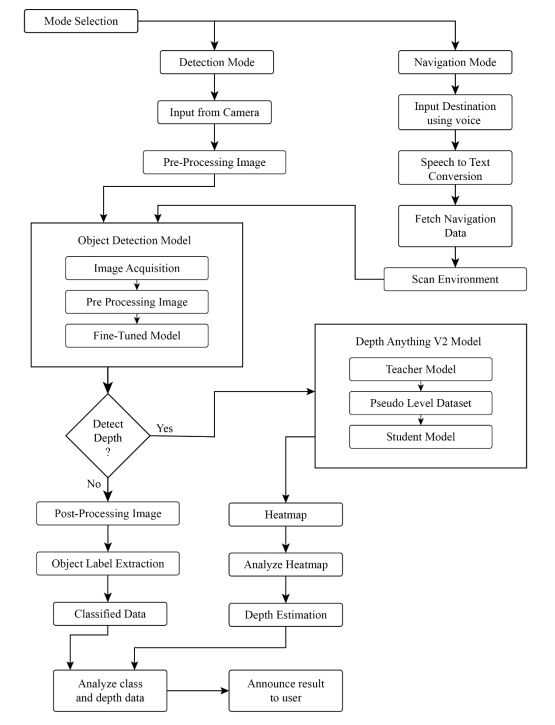
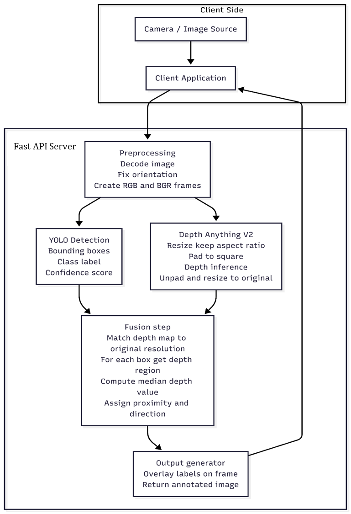

## Project Overview

**NETRA** is an AI-powered navigation and vision assistant built for visually impaired individuals. It combines real-time **obstacle detection**, **monocular depth estimation**, and **voice-guided navigation**.

A custom-trained **YOLOv11s** model detects critical objects — pedestrians, vehicles, crosswalks, stairs, guide blocks, and traffic signals while **Depth Anything V2** estimates their distance from the user. A **FastAPI** inference server processes detections and communicates with a **Flutter** mobileapp, delivering real-time audio alerts and turn-by-turn directions via **OpenStreetMap**.

The app is built with accessibility at its core, leveraging Android's built-in**TalkBack** feature to deliver audio feedback.Unlike existing tools that handle either navigation or detection isolation, NETRA unifies both into one accessible platform.

---

## System Pipeline

NETRA operates in two modes selected by the user at launch.

**Detection Mode**
Camera frames are preprocessed and passed to the **YOLOv11s** model, which
identifies nearby objects — pedestrians, vehicles, crosswalks, stairs, traffic
signals, and guide blocks. **Depth Anything V2** then estimates the distance of
each detected object. The combined results are analyzed and delivered to the
user as audio feedback via TalkBack.

**Navigation Mode**
The user speaks a destination, which is converted to text and used to fetch a
walking route via **OpenStreetMap**. The camera continues scanning for nearby
obstacles in parallel, and the system provides real-time voice-guided
instructions throughout the journey.



---

## AI Models

NETRA uses two core AI models to perceive and understand the environment in
real time.

### Object Detection — YOLOv11s

A custom fine-tuned **YOLOv11s** model detects navigation-critical objects from
live camera frames. Detected classes include:

- Pedestrians, vehicles
- Crosswalks, traffic signals
- Guide blocks, stairs, obstacles

The model outputs bounding boxes and class labels for each detected object.

### Depth Estimation — Depth Anything V2

**Depth Anything V2** estimates the distance of detected objects using a single
RGB camera — no LiDAR or stereo setup required. It generates a depth map per
frame where pixel intensity corresponds to relative distance from the camera.

### Combined Perception

Detection and depth outputs are fused to give the system a full understanding
of the user's surroundings — what objects are present, how far they are, and
whether they pose a risk. This drives the real-time audio feedback delivered
to the user.



---

## Dataset

The YOLOv11s model was trained on a custom dataset sourced from **Roboflow Universe**, containing navigation-relevant objects common in pedestrian environments.

### Classes (14)

`bicycle` `bus` `car` `chair` `crosswalk` `door` `green pedestrian light`
`guide blocks` `motorcycle` `person` `pothole` `red pedestrian light`
`stairs` `table`

### Annotations

Labels are in **YOLO bounding box format**:
```
<class_id> <x_center> <y_center> <width> <height>
```
All values are normalized relative to image dimensions.

### Augmentation

Training used the **Ultralytics YOLO pipeline** with automatic augmentations color variation, scaling, flipping, mosaic, and translation to improve
generalization across real-world lighting and environmental conditions.

---

## Model Training

The YOLOv11s model was trained using the **Ultralytics YOLO training pipeline** for detecting navigation-relevant objects.

### Training Configuration

## Model Training

The YOLOv11s model was trained using the **Ultralytics YOLO pipeline** for detecting navigation-relevant objects.

### Training Configuration

| Parameter | Value |
|-----------|-------|
| Architecture | YOLOv11s |
| Image Size | 640 × 640 |
| Max Epochs | 100 (early stopped at 55) |
| Batch Size | 16 |
| Optimizer | AdamW |
| Learning Rate | 0.001 |
| Weight Decay | 0.0005 |
| Mixed Precision (AMP) | Enabled |
| Device | GPU |
| Early Stopping Patience | 10 |

---


